# Laravel-Reactjs-Inertiajs-Cars-System

# Overview
This project provides a robust solution for managing an cars system,Full cars Fees with shipping fees and won fees, including Money Boxses management, customer,Full Permission System for every movement on the system
,It supports only Arabic.

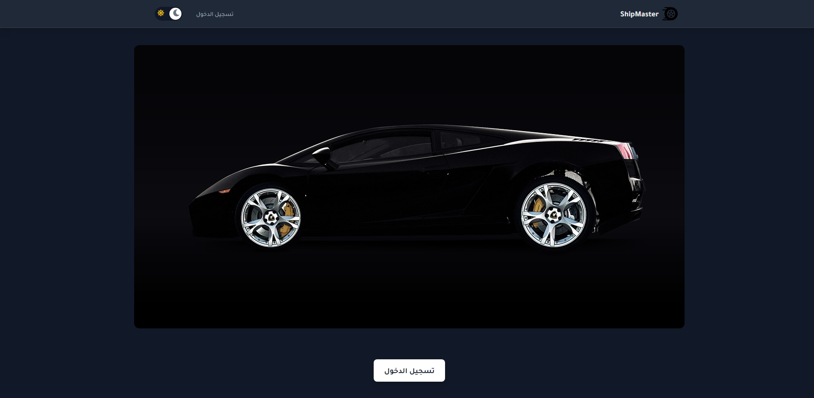
# Features

1. Full Permission System for every movement on the system
2. Admin / Account / Customer / User Roles
3. Perfect Multi Step Form For Cars with (CRUD Operations)
4. Full shipping Fess system
5. Account And Boxses Management
6. Customer Management
7. Customer Credit
8. Customer Dashboard
9. Light Dark mode
10. Arabic
11. Laravel 11
12. Reactjs Inertiajs
    

# Images
Cars
CRUD operations for managing Cars information ,multi shipping fees on one car .
Upload cars images with date category.

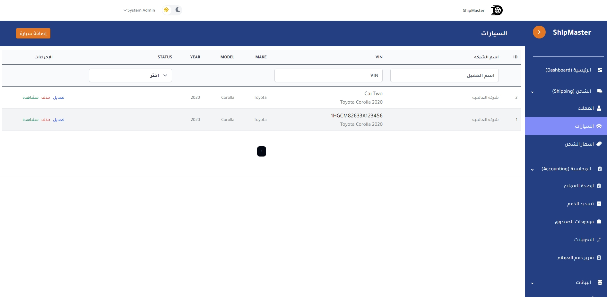
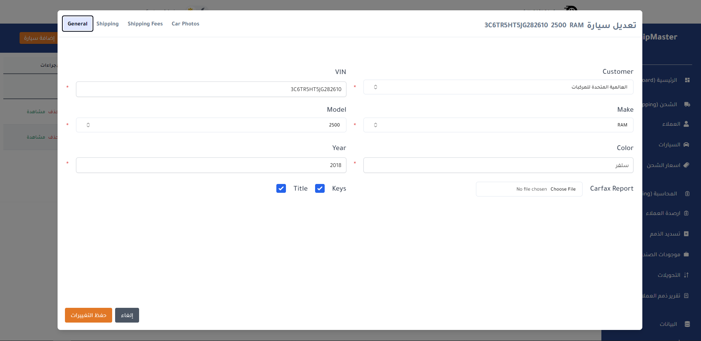
Shipping Fee Details
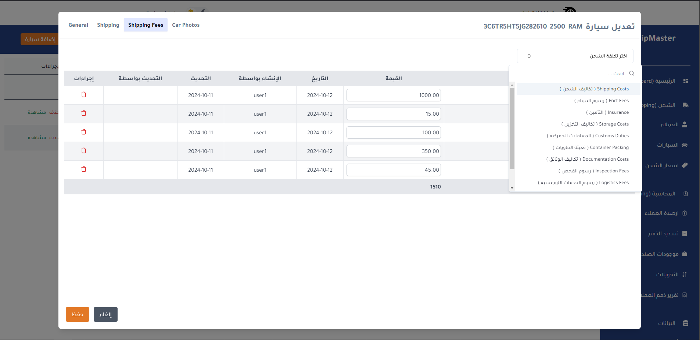
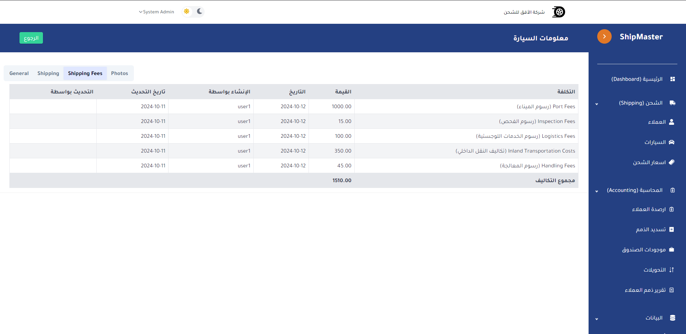
Cars Images With  Details
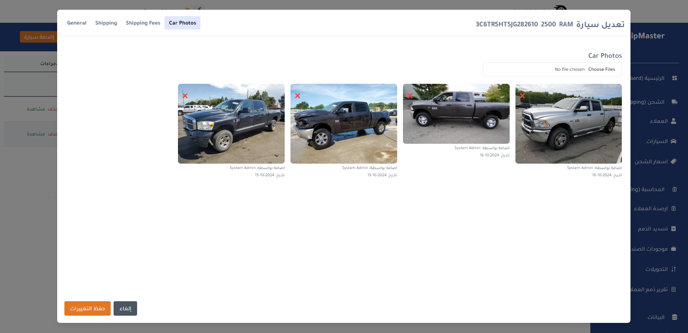
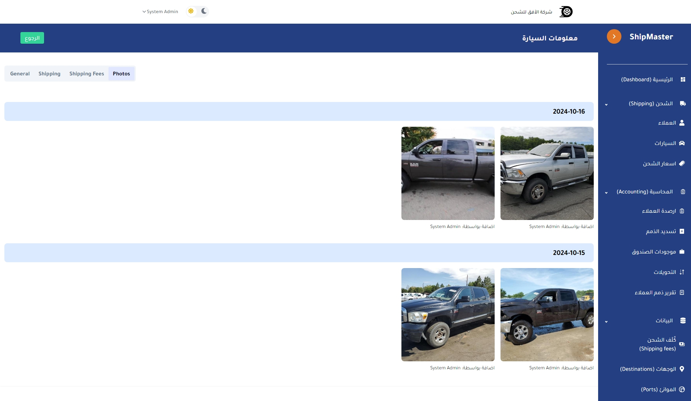
Shipping Fee Details Table for every destination Shipping Line and port
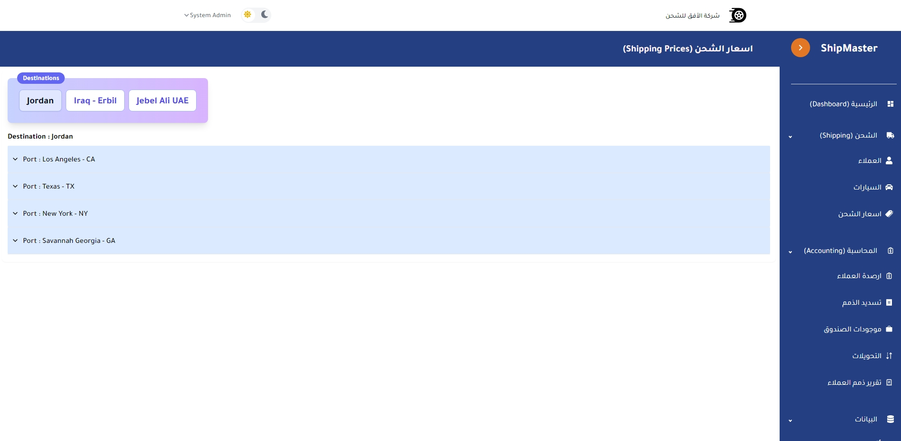
Every Customer Credit Information
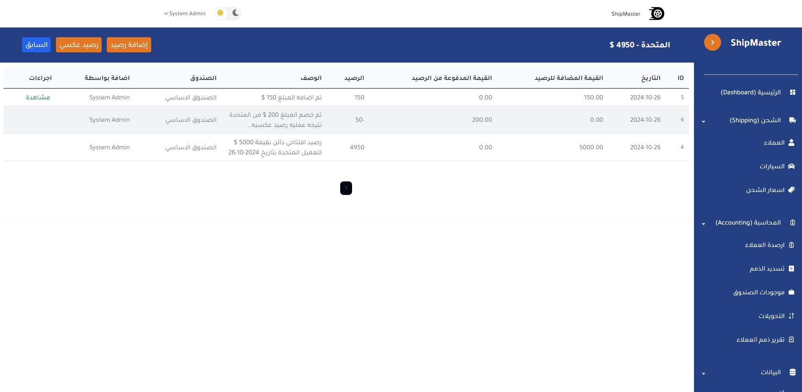
Payment for Every Car
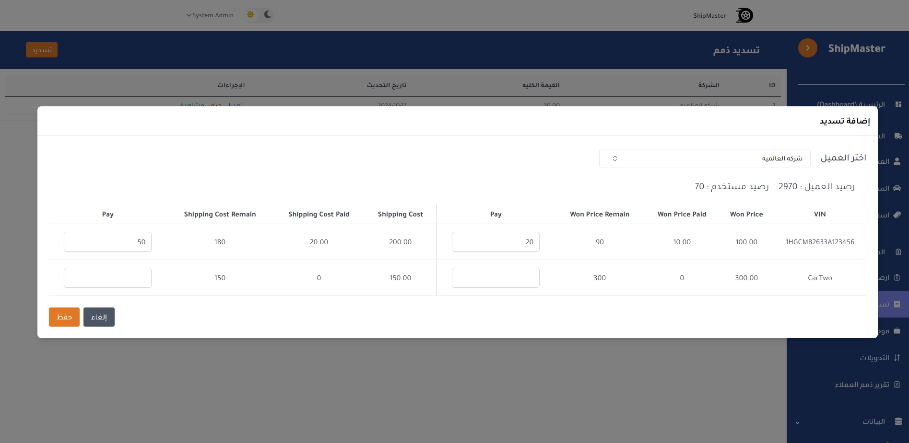
Every Box money
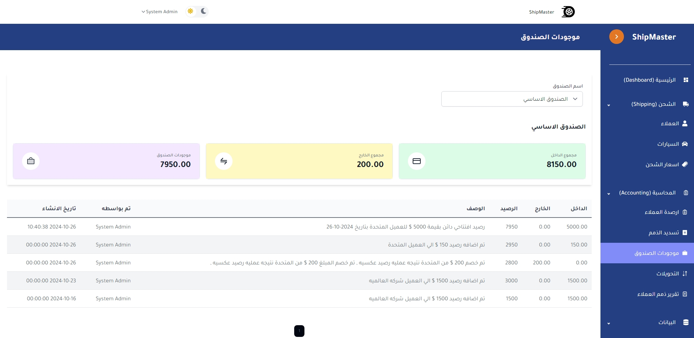
Transformation money between boxes 
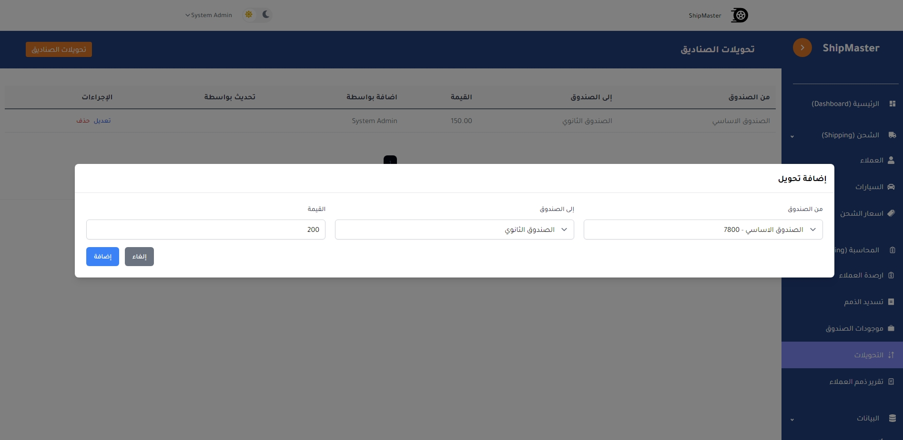
Report for everyr Customer About his payment
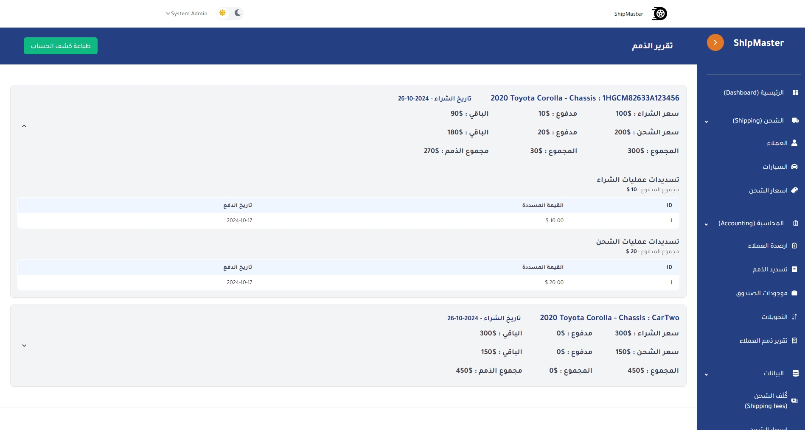
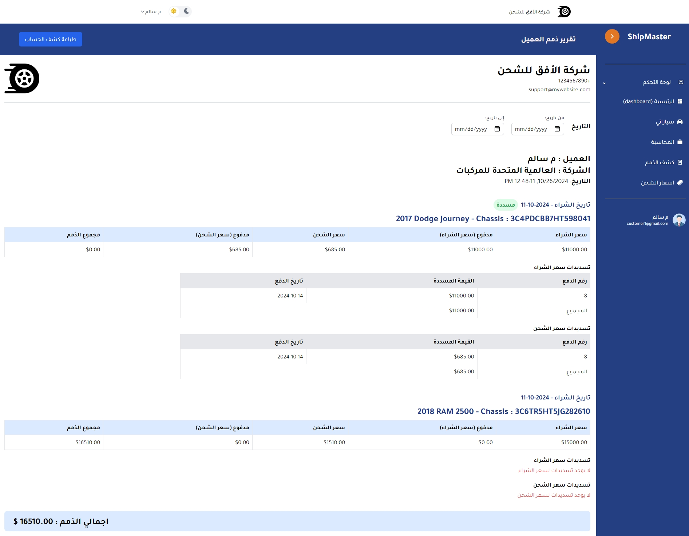

Full Permission System for every movement on the system
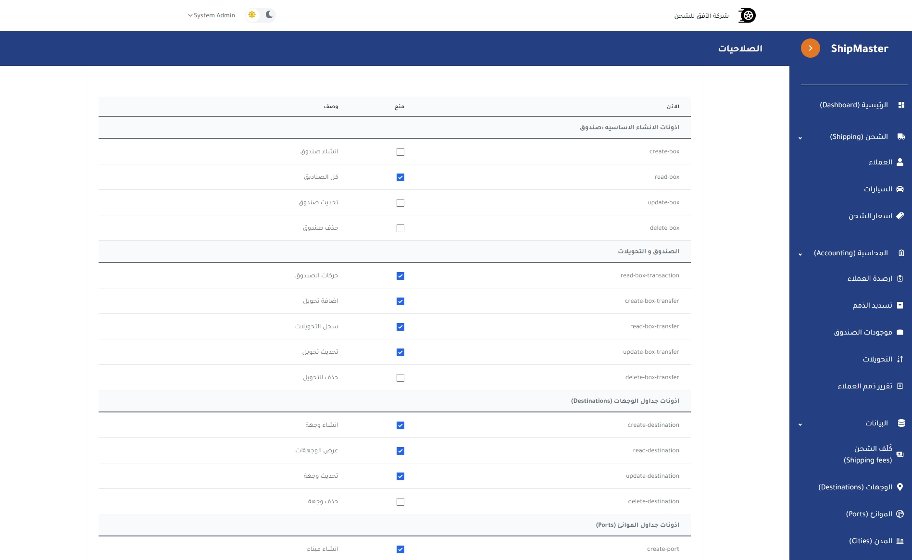

### Installation

1. Set up your database credentials in the `.env`
2. Run `composer install` to install dependencies
3. Run `npm install` to install dependencies
4. Run `php artisan migrate --seed` to create the database tables
5. Run `npm install` to install the frontend dependencies
6. Run `npm run dev`
7. Run `php artisan serve`
